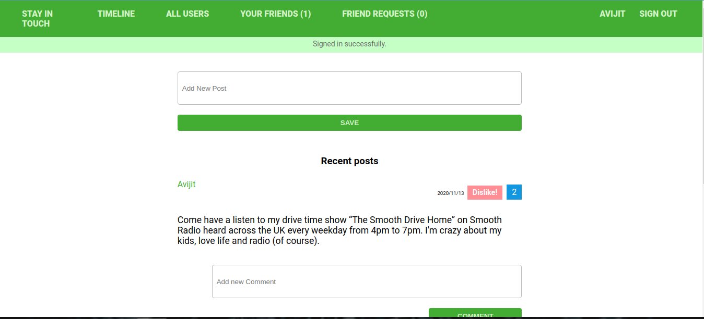

# Scaffold for social media app with Ruby on Rails

> This is a Microverse Ruby on rails project that try to create a mini social media. The  main aim of this project was to create a social media app that user can use to create friendships, posts, comments and likes. This project has  many to many associations. It uses devise gem for authentication and it also has functionalities of sending friendship requests to
multiple individuals.  



## Features
In this project I tried to add functionalities in a given social media ruby on rails app template:

- The back end is set up with User,post,comments, sessions and friendship models that validates presence of name,password,post,comments,likes and friendship. These models also contains different associations between each other.
- Devise gem was used in session authentication.
- If user check the page without being authenticated, he/she will not be able to see the home page or can use any functionalities.
- Any user who signed up and logged in can create their own post.
- Any user who signed up and logged in can send and accept friendship requests.
- Any user who signed up and logged in can delete and remove friendship requests.
- User show page displays post description with number of likes and with comments made by other users.
- User can give like to the posts of other users.
- User can see his or her list of users.

## Built With

- Ruby on Rails
- Ruby
- Rubocop
- Atom text editor
- Devise
- Will paginate gem
- Rspec gem
- Capybara gem

# Getting Started

To get a local copy of the repository please run the following commands on your terminal:

```
$ cd <folder>
```

```bash
$ git clone `https://github.com/ajkacca457/ror-social-scaffold.git`
$ cd ror-social-scaffold.git
$ bundle install
$ yarn install --check-files if yarn is not updated
$ Run `rails db:create` to create database
$ Run `rails db:migrate` to create necessary tables in database
$ Run `rails server` to see the user interface.
$ Open your browser and go to http://localhost:3000/
```

### Run tests

```
    rpsec --format documentation
```

# Authors

👤 **Avijit Karmaker**

- Github: [@Avijit](https://github.com/ajkacca457)
- Linkedin:[@Avijit](https://www.linkedin.com/in/avijit-karmaker-8738a54)

## 🤝 Contributing

Contributions, issues and feature requests are welcome!

## Show your support

Give a ⭐️ if you like this project!

## Copyright
This is a project developed by Microverse Student as the part of skill curriculum.
